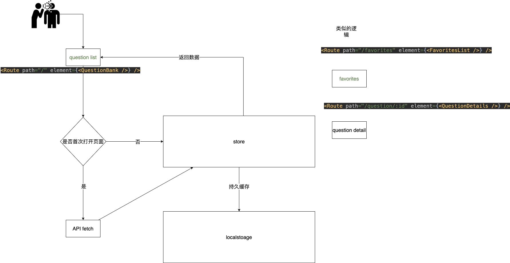
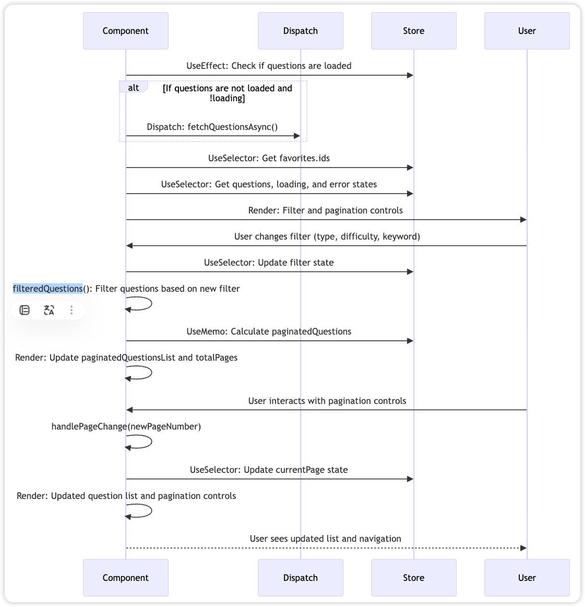
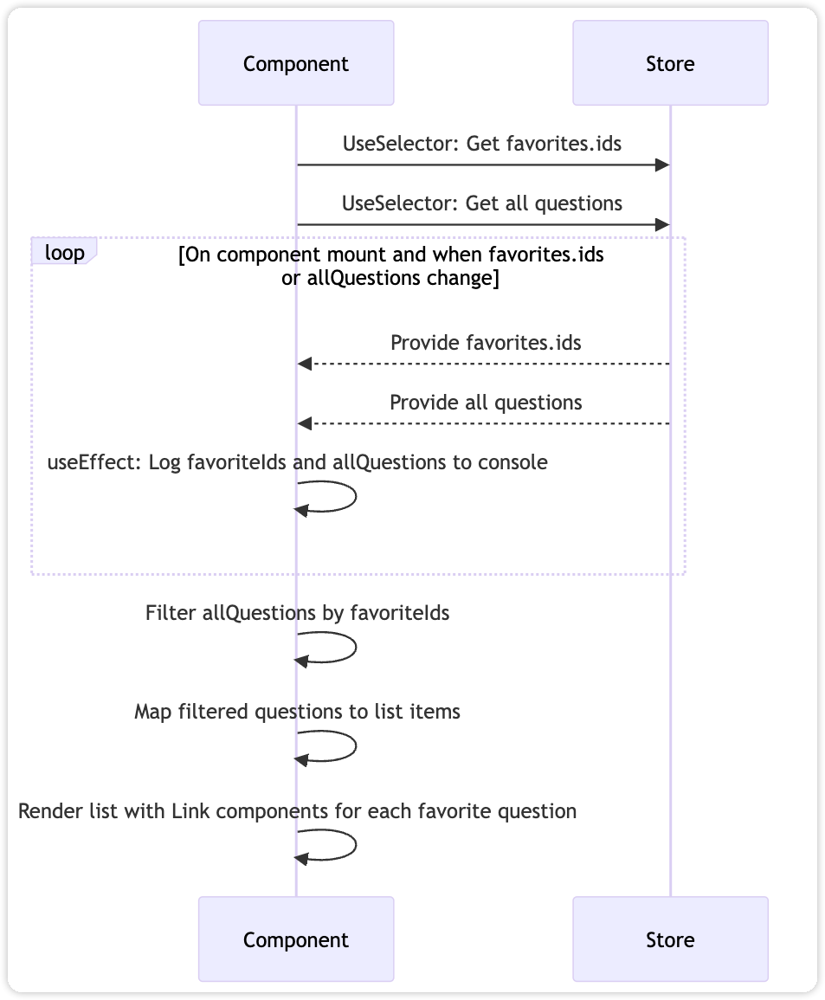
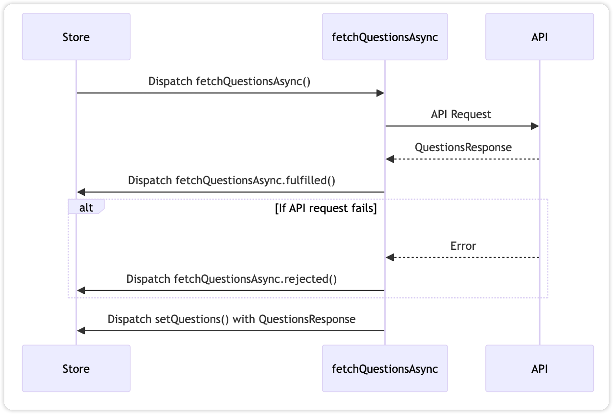

# Interview Questions Bank Demo

## Overview

`interview-questions-bank-demo` is an open-source project designed to provide a comprehensive and interactive platform for users to prepare for technical interviews. It is built using the latest web technologies and follows best practices in React application development. This project was bootstrapped with [Create React App](https://github.com/facebook/create-react-app), ensuring a streamlined setup and development process.

## Features

- **Interactive Question Bank**: Browse through a variety of technical questions categorized by type and difficulty.
- **Real-Time Filtering**: Quickly find questions relevant to your needs using filters for type, difficulty, and keywords.
- **Favorites Management**: Save questions for later review with a simple click.
- **Pagination Support**: Easily navigate through sets of questions without overwhelming the interface.
- **Responsive Design**: Optimized for use across various devices and screen sizes.

## flow 




### sequenceDiagram for question bank index page



### sequenceDiagram for FavoritesList page



### sequenceDiagram for question store


## Getting Started

To get started with the project, clone the repository and install the necessary dependencies:

```bash
git clone https://github.com/[YOUR_USERNAME]/interview-questions-bank-demo.git
cd interview-questions-bank-demo
npm install
```

### `npm start`

Runs the app in the development mode. Open [http://localhost:3000](http://localhost:3000) to view it in the browser.

The page will reload if you make edits. You will also see any lint errors in the console.

### `npm test`

Launches the test runner in the interactive watch mode. See the section about [running tests](https://facebook.github.io/create-react-app/docs/running-tests) for more information.

### `npm run build`

Builds the app for production to the `build` folder. It correctly bundles React in production mode and optimizes the build for the best performance.

The build is minified and the filenames include the hashes. Your app is ready to be deployed!

See the section about [deployment](https://facebook.github.io/create-react-app/docs/deployment) for more information.

### `npm run eject`

**Note: this is a one-way operation. Once you `eject`, you can’t go back!**

If you aren’t satisfied with the build tool and configuration choices, you can `eject` at any time. This command will remove the single build dependency from your project.

Instead, it will copy all the configuration files and the transitive dependencies (webpack, Babel, ESLint, etc) right into your project so you have full control over them. All of the commands except `eject` will still work, but they will point to the copied scripts so you can tweak them. At this point you’re on your own.

You don’t have to ever use `eject`. The curated feature set is suitable for small and middle deployments, and you shouldn’t feel obligated to use this feature. However, we understand that this tool wouldn’t be useful if you couldn’t customize it when you are ready for it.

## Contributing

We welcome contributions to the project! If you have an idea for a new feature or have found a bug, please open an issue or submit a pull request.

## Learn More

To learn React, check out the [React documentation](https://reactjs.org/).

For more information on the Create React App toolchain, visit the [Create React App documentation](https://facebook.github.io/create-react-app/docs/getting-started).

## License

This project is licensed under the MIT License - see the [LICENSE](LICENSE) file for details.


